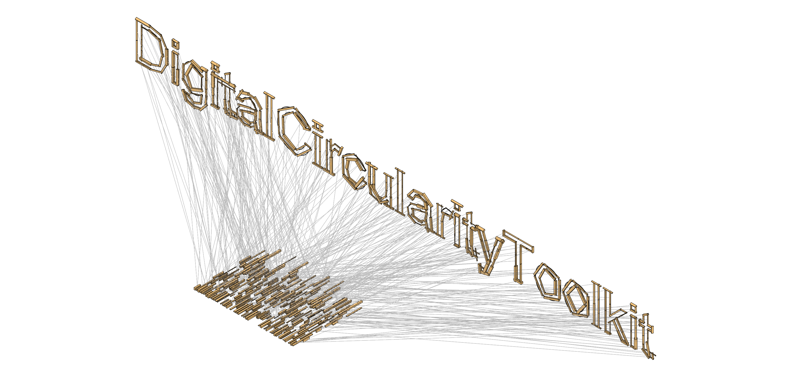

# DigitalCircularityToolkit
A Grasshopper plugin to facilitate circular/reuse/inventory-driven design workflows, including:
- Extracting principal axes from arbitrary geometry
- Abstractions as primitive lines, planes, boxes, and spheres
- Knolling and alignment
- Shape characterization: LineScore, PlaneScore, BoxScore, SphereScore, RadialSignature
- Fourier shape descriptors (in complex and real coordinates) of radial signatures
- Custom feature vector definitions
- Optimal assignment using the Hungarian matching algorithm
- Visualization tools for assignment

# Installation
1. Find and download the latest build (.zip file) in the [releases](https://github.com/keithjlee/DigitalCircularityToolkit/releases) page.
2. Find your Grasshopper components folder by opening Grasshopper, then `File>Special Folders>Components Folder`
3. **For Windows users:** right click the downloaded .zip file and select `Properties`, and make sure that `Unblock` is checked off.
4. Directly extract the contents of the .zip file to your Components Folder.
5. Restart Rhino/Grasshopper

