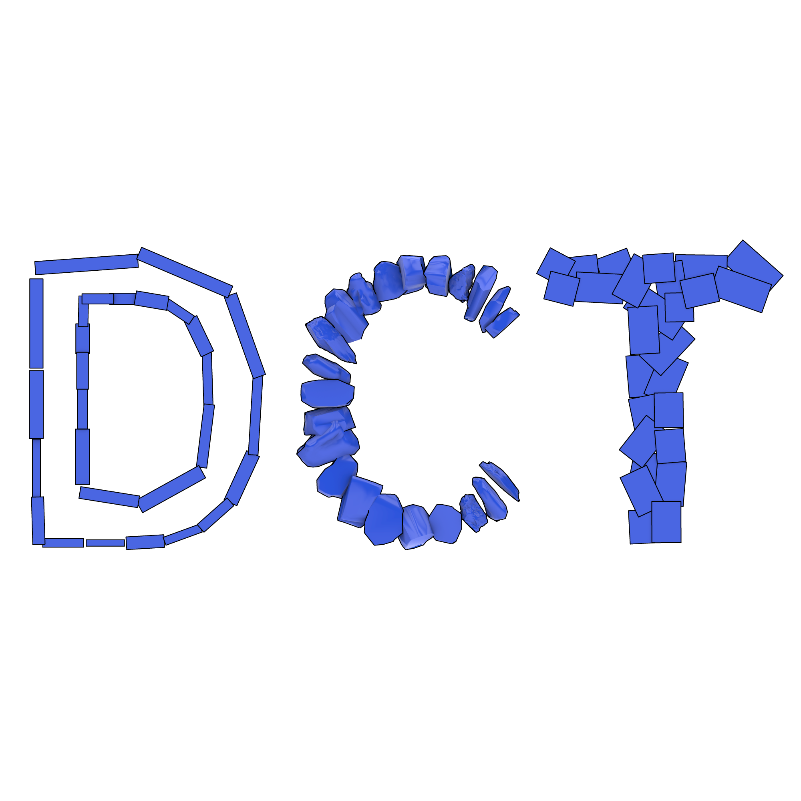
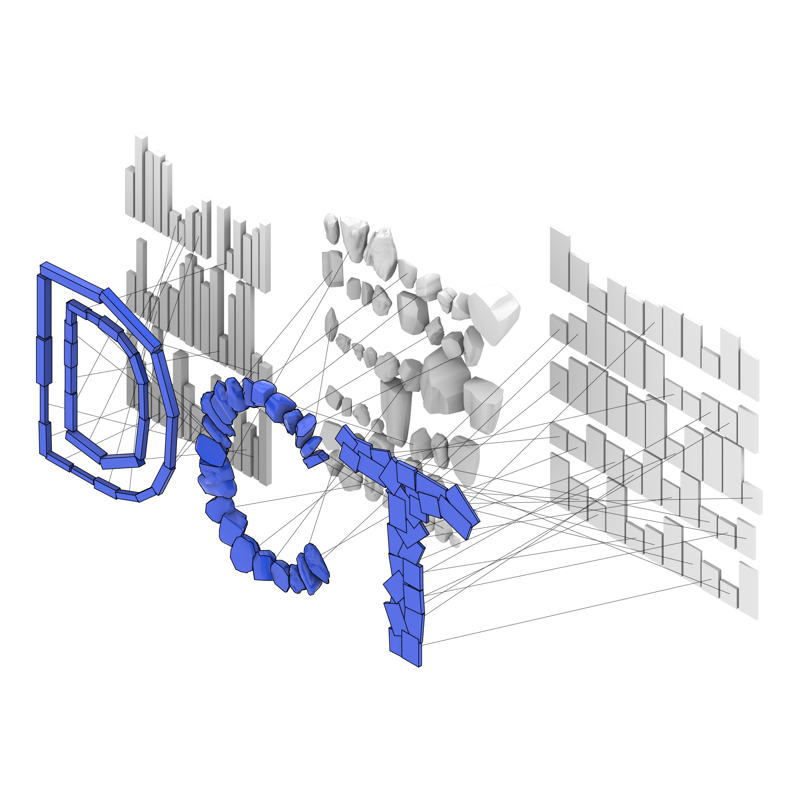

[](https://doi.org/10.5281/zenodo.10724610)



Available on [Food4Rhino](https://www.food4rhino.com/en/app/digitalcircularitytoolkit?lang=en).
# DigitalCircularityToolkit
A Grasshopper plugin to facilitate circular/reuse/inventory-driven design workflows, including:
- Extracting principal axes from arbitrary geometry
- Abstracing objects as primitive lines, planes, boxes, and spheres
- Knolling and alignment
- Shape characterization: LineScore, PlaneScore, BoxScore, SphereScore, RadialSignature
- Fourier shape descriptors (in complex and real coordinates) of radial signatures
- Custom feature vector definitions
- Optimal assignment
- Visualization tools for assignment

This toolkit provides a generalized approach to the Digital Circularity workflow outlined by [Cousin et al](https://scholar.google.com/citations?view_op=view_citation&hl=en&user=0RMLrVgAAAAJ&sortby=pubdate&citation_for_view=0RMLrVgAAAAJ:VLnqNzywnoUC).

## Installation
The latest build (v0.4) are avilable of [Food4Rhino](https://www.food4rhino.com/en/app/digitalcircularitytoolkit?lang=en) or in the releases page. Two packages are now available, target .NET 4.8 (For Rhino 7, Windows + Mac) and .NET 7 (For Rhino 8, Windows + Mac).

1. Find and download the latest build (.zip file) in the [releases](https://github.com/keithjlee/DigitalCircularityToolkit/releases) page.
2. Find your Grasshopper components folder by opening Grasshopper, then `File>Special Folders>Components Folder`
3. **For Windows users:** right click the downloaded .zip file and select `Properties`, and make sure that `Unblock` is checked.
4. Directly extract the contents of the .zip file to your Components Folder.
5. Restart Rhino/Grasshopper

## Citing
When using or extending this software for research purposes, please cite using the following:

### Bibtex
```
@software{lee_2024_10724610,
  author       = {Lee, Keith Janghyun},
  title        = {DigitalCircularityToolkit},
  month        = feb,
  year         = 2024,
  publisher    = {Zenodo},
  version      = {v0.4},
  doi          = {10.5281/zenodo.10724610},
  url          = {https://doi.org/10.5281/zenodo.10724610}
}
```

### Other styles
Or find a pre-written citation in the style of your choice [here](https://zenodo.org/records/10724610) (see the Citation box on the right side). E.g., for APA:
```
Lee, K. J. (2024). DigitalCircularityToolkit (v0.2). Zenodo. https://doi.org/10.5281/zenodo.10724610
```

# Examples
## Matching lengths to truss design

See `Examples>01_trusses>01_trusses`

Features used:
- `LinearObject` class
- Adding `qty` for duplications of objects
- Creating `FeatureVector`s
- `EuclideanDistance` for distance matrix generation
- `Hungarian` for matching
- `AlignToObject` for aligning matched inventory objects to drawn design
- `MatchLines` to draw matching lines

## Incorporating structural analysis to truss matching

See `Examples>01b_trusses>01b_trusses_karamba`

Features used:
- `LinearObject` class
- Adding `qty` for duplications of objects
- Integrating with Karamba3d and other plugins
- Creating custom `FeatureVector`s to have multiple dimensions
- `EuclideanDistance` for distance matrix generation
- `Hungarian` for matching
- `AlignToObject` for aligning matched inventory objects to drawn design
- `MatchLines` to draw matching lines

## Beading curves with rocks

See `Examples>02_rock_beading>02a_linear_beading` and `02b_box_beading`

Features used:
- `LinearObject` and `BoxObject`
- `OverridePCA` to set a custom orientation for objects

## Tiling rocks into a Voronoi plane

See `Examples>03_rock_tiling>03_rock_tiling`

Features used:
- `PlanarObject` to abstract objects as planes
- `PlanarOutline` to get the 2D curve representation of an object
- `RadialSignature` to perform ray sampling of the planar outlines
- `HarmonicsAnalysisComplex` to extract feature vectors from complex radial signatures

# Development Notes
- This plugin was developed by Keith J. Lee, PhD Candidate (Associaton: MIT > Architecture > Building Technology > Digital Structures > Digital Circularity).
- [Karl-Johan Soerensen](https://github.com/soerensenkarl) developed I/O functionality for read/write workflows with Google Sheets and local .CSV files. To be released publicly in the near future.
- Initial release was given to students taking the IAP2024 design workshop: *4.181 Digital Circularity: Tooling up for reuse with Odds & Mods*
- Public release coincides with the S2024 design workshop: *4.185 ODDS & MODS Castaways*
- The Digital Circularity team consists of Rachel Blowes (SMArchS BT '25), Celia Chaussabel (SMArchS AD '25), Alex Htet Kyaw (SMArchS Comp '25), Keith J. Lee (PhD BT '25), and Karl-Johan Soerensen (SMArchS Comp '25 + SM CEE '25). We are advised by Professor Caitlin Mueller.

# Release Notes
## Dec 15 2024
- `Hungarian` is now an obsolete component (still available to use for older projects) and is superseded by `Match`. This uses the Jonker-Volgenant matching algorithm, and results in a 100-500x speed improvement.
- New Distance Matrix generator `ManhattanDistance` computes the Manhattan distances between feature vectors (e.g., sum of components distance)
- `Frechet` computes the Frechet distance between two open curves
- `HausdorffCurve` and `HausdorffPoints` computes the Hausdorff distance between two closed curves or two sets of points.

## Feb 28 2024
- `v0.2` was released to enable Zenodo DOI and add minor description changes in some components. No functional changes.

